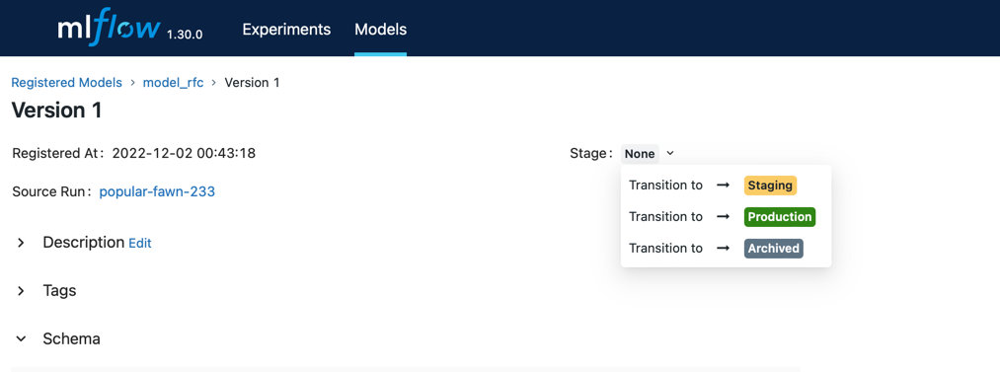

**Homework №3**
==============================

## *Launch instructions*

### ***Run airflow***

Activate your env and then run in `airflow/`:
~~~
./run.sh
~~~
After this you can go to the server at http://127.0.0.1:8080  
Your login and password are the same: **admin**    
  
You can run `get_data` dag and `train_pipeline` dag, but to make predictions
you have to choose __production model__.
For this you should do following:
1. Go to __mlflow__ at http://127.0.0.1:5050 
2. Switch to `Models` page
3. Choose sufficient version of model_rfc
4. Click `Stage` button and choose `Transition to -> Production`
    

Then you can run `predict` dag and get your predictions in  
`/data/predictions/{{ ds }}`  
 
### ***Run tests***

Switch to new window in console and run:
~~~
docker exec -it airflow-scheduler-1 bash -c "pip3 install pytest && python3 -m pytest --disable-warnings tests/"
~~~